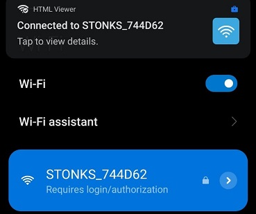
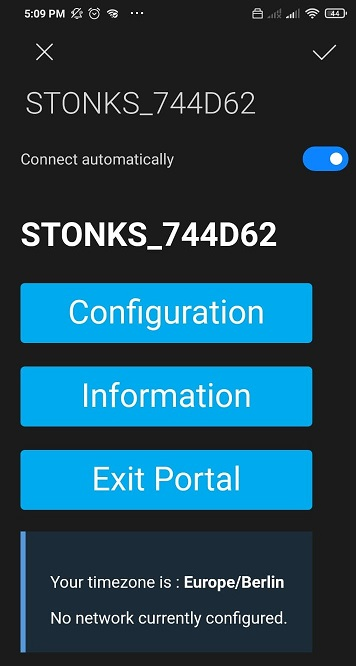
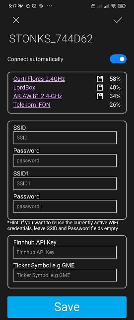

# Stocks monitor 
A monitor of your favorite stock using an ESP8266 (or ESP32), a display and a servo motor indication to indicate when you to the moon.

## Motivation
This started as a weekend project for myself after I saw [this reddit post](https://www.reddit.com/r/wallstreetbets/comments/lfkprt/finished_my_diy_project_just_in_time_for_gme_to/). However checking the comments I decided to make it public and configurable so that anybody with at least an ESP board and a generid SSD1306 display can make your own.

## How to use?
In the first boot if no password was stored (Or if you press the secondary/flash button from the board), an access point called STONKS_*ESPMACADDRESS* will be created.

After connecting to it, a configuration portal should open.

Then, select your wifi network(s) and insert the password(s), your personal finnhub API key and the [ticker symbol](https://en.wikipedia.org/wiki/Ticker_symbol).

After this, the ESP will make the request to the finnhub API and fetch, every minute, the current stock price and close price from previous day. Then, the ESP will display the value, difference and difference in percentage for the day in the display and turn the servo motor according to the day gain in %.

## How to build, run and assembly.

## Tech/framework used
<b>Built with</b>
- [VS Code](https://code.visualstudio.com/) and [PlatformIO](https://platformio.org/)

## Credits
Original idea from [this reddit post](https://www.reddit.com/r/wallstreetbets/comments/lfkprt/. Special thanks to @khoih-prog for providing the [library for wifi management on ESP](https://github.com/khoih-prog/ESP_WiFiManager).

## License
A short snippet describing the license (MIT, Apache etc)

GPL-3.0 License © [JpCurti](https://github.com/jpcurti)
